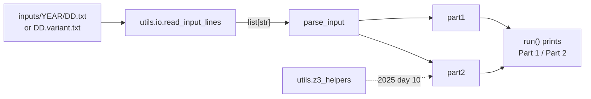

# Architecture overview

Why the repository is organised the way it is, and how its parts connect. For what each function and setting does, see the [reference](../README.md#reference) pages.

## Context

The repository holds one person's Advent of Code solutions across years, in one Python project. Each puzzle day is a standalone script. The only shared code is a small `utils` package. There is no framework, plugin registry or runner: a day is added by creating a file, and run by executing it.

## Components

| Component | Location | Role |
| --- | --- | --- |
| Day modules | `<year>/<DD>/main.py` | One script per puzzle: parse the input, compute both parts, print them. |
| `utils.io` | `utils/io.py` | Maps `(year, day, variant)` to a file under `inputs/` and reads it. |
| `utils.z3_helpers` | `utils/z3_helpers.py` | Typed wrappers around the z3 solver, used by 2025 day 10. |
| Inputs | `inputs/<year>/` | Puzzle inputs. Only `*.sample.txt` files are committed. |
| Tests | `tests/` | Per-day tests, `utils` tests and a test of every day's printed output. |
| CI | `.github/workflows/ci.yml` | Tests on Python 3.11 to 3.14; lint, format and type checks. |
| Dependabot | `.github/dependabot.yml` | Weekly update pull requests for `uv.lock` and the CI actions. |
| Agent guidance | `AGENTS.md`, `.agents/skills/` | Instructions and a vendored skill for AI coding agents. Not used by the code. |

## Data flow

`run(variant)` drives the flow. Executed as a script, a module calls `run()` with no variant and reads the real input. The tests call `parse_input`, `part1` and `part2` directly on sample data, and `tests/test_cli.py` calls `run("sample")` and captures what it prints.

## How imports resolve

Day modules import `utils` even though they sit two directories below it. When Python runs `2025/01/main.py`, it puts `2025/01/` on `sys.path`, not the repository root. The import works because `[tool.uv] package = true` makes `uv sync` install the project in editable mode, and the editable install adds the repository root to `sys.path` for every interpreter in `.venv/`. That is why scripts must run through `uv run` (or the `.venv` interpreter).

The day folders are not packages, and their names are not valid Python identifiers: `import 2025.01.main` is a syntax error. The tests therefore load each `main.py` by file path with `importlib` (`load_module` in `tests/_helpers.py`), under a unique module name such as `aoc2025_day01`. Each test file declares a `Protocol` for the module it loads, which gives ty the types that a path-based import cannot provide.

`utils.io` resolves `inputs/` relative to its own file, so input paths do not depend on the working directory.

## Testing approach

The suite has three layers:

1. **Sample tests** in `tests/<year>/test_<DD>.py` check each part against the expected answer for the committed sample input. Many days add edge cases and error paths.
2. **Output tests** in `tests/test_cli.py` pin the exact text each 2025 `run("sample")` prints. They protect the `Part 1:`/`Part 2:` labels and the `YEAR`/`DAY` wiring, which the sample tests bypass.
3. **Reference tests** for days whose algorithm was rewritten for speed (2025 days 8 and 9). The test file carries a simple reference implementation of the slower approach the solution replaced, and requires the optimised version to match it on generated inputs (`cc760bb`, `9bc0312`).

No test needs a real puzzle input, so the suite runs on a fresh clone and in CI.

## Design decisions

The rationale for each decision is recorded in the commit that made it; the hash is given so you can read the full reasoning with `git show <hash>`.

### Real inputs are never committed

Puzzle inputs are not meant to be republished, so `.gitignore` ignores everything under `inputs/` except `*.sample.txt`, whatever the file extension (`8a01355`). `.env` files are ignored too, because that is where an Advent of Code session cookie usually goes. The cost is that a fresh clone can run each day only on its sample until you add your own input.

### Static checks at full strictness

ty runs with every rule as an error (`3c64d3b`), and only `# ty: ignore[<rule>]` suppresses a diagnostic (`09d5b0c`). A bare `# type: ignore` would silently hide every diagnostic on its line, and ty would never report it as unused. ruff enables a broad rule set, including some families that had no findings when they were added; they guard against regressions (`6b7b5fd`).

### z3 behind a typed wrapper

z3's Python bindings return loosely typed values. `utils.z3_helpers` casts them once, in one module, so the day 10 solution is fully typed without suppressions (`3c64d3b`). Day 10 part 2 is the only z3 user: it is an integer program that minimises total button presses subject to exact counter targets. Day 11 part 2 uses a bitmask dynamic program over a topological order, which its docstring says avoids the need for a general-purpose solver.

### Each test file gets a path-based module name

pytest runs with `--import-mode=importlib` (`1ec7d27`). Without it, `tests/2025/test_01.py` and a later `tests/2026/test_01.py` would both import as `test_01` and fail collection. This is what makes adding a second year work without renaming tests.

### CI enforces the lock file

CI installs with `uv sync --locked` and runs every tool with `uv run --no-sync` (`8535fdb`). `--frozen` would accept a lock that no longer matches `pyproject.toml`, and a plain `uv run` would silently rewrite it. With `--locked`, a stale `uv.lock` fails the build. The three actions are pinned by commit SHA (`0c5c46b`, `a89cb72`, `f432094`), and Dependabot proposes updates to both the lock and the SHAs, a week after each upstream release (`e9a074a`).

### Day 12 decides large regions by area and bounds only

`can_fit_region` runs an exact packing search only when a region has at most 220 cells and at most 14 pieces. Any other region returns `True` once every requested shape fits inside the region's bounds and the total shape area does not exceed the region's area. This is a necessary condition for a packing, not a proof that one exists. The function's docstring states that it is adequate for the 2025 day 12 input sizes. The trade-off is speed on real inputs against generality, and `tests/2025/test_12.py` pins the shortcut so that a change to it is visible (`f926e2e`).
